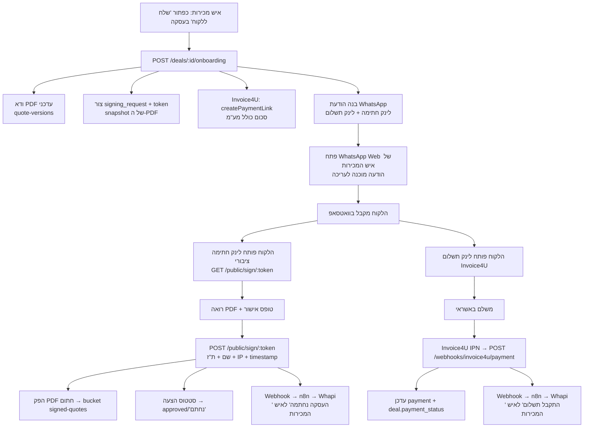

# תכנון: תהליך הצעת מחיר → חתימה → תשלום (Onboarding Flow)

> מסמך תכנון בלבד. אין עדיין קוד. עודכן לפי החלטות המשתמש:
> חתימה = **אישור פשוט**; התראות = **n8n + Whapi**; קצב = **בשלבים (חתימה קודם)**.

## 1. מטרה

בסיום תהליך הצעת מחיר, איש המכירות לוחץ כפתור אחד בעסקה וה‑CRM:
1. מוודא שיש PDF עדכני להצעה.
2. מייצר לינק תשלום אשראי (Invoice4U / משולם) על הסכום כולל מע"מ.
3. מייצר **לינק חתימה ציבורי** לצפייה ב‑PDF + אישור/חתימה.
4. פותח WhatsApp Web של איש המכירות עם הטמפלט מוכן לעריכה ושליחה ללקוח.

לאחר שהלקוח **חותם**:
- איש המכירות מקבל התראת WhatsApp.
- ההצעה עוברת לסטטוס "נחתם".
- המסמך החתום מתויק.

לאחר שהלקוח **משלם**:
- איש המכירות מקבל התראת WhatsApp שהתקבל תשלום.

---

## 2. מצב קיים (Baseline — מה כבר בנוי)

| יכולת | סטטוס | קובץ |
|---|---|---|
| הפקת PDF להצעה (Playwright → bucket `quote-pdfs`, signed URL) | ✅ | `api-server/src/routes/quote-versions.ts`, `lib/quote-html.ts` |
| לינק תשלום Invoice4U (`createPaymentLink` → `ClearingRedirectUrl`) | ✅ בנוי, לא נבדק חי | `api-server/src/lib/invoice4u.ts`, `routes/payments.ts` |
| Deep-link ל‑WhatsApp Web של איש המכירות | ✅ | `api-server/src/lib/whatsapp-link.ts` |
| מודאל "צור לינק תשלום" בעסקה | ✅ | `bist-app/src/pages/deals-detail.tsx` (`PaymentLinkModal`) |
| בעלים לעסקה + טלפון | ✅ | `deals.salesperson_id` → `app_users.phone` |
| סטטוס הצעה `approved`/"נחתמה" (ידני) | ✅ label | `quotes.status`, `bist-app/src/pages/quotes.tsx` |
| **התראת WhatsApp יזומה דרך n8n** (fire-and-forget) | ✅ קיים! | `api-server/src/lib/invoiceWebhook.ts` — נקרא ב‑`deals.ts:1027` |

> **תגלית (Aug 10):** מנגנון ההתראות ל‑n8n **כבר בנוי** ומחובר ל‑n8n cloud האמיתי. `sendInvoiceWebhook({message})` שולח `POST { message }` ל‑`INVOICE_WEBHOOK_URL` (ברירת מחדל `https://rambist.app.n8n.cloud/webhook/invoice-details/development`). היום נורה **בזמן יצירת עסקה, רק למזומן/העברה בנקאית**. יש מתג `INVOICE_NOTIFY_ENABLED`. **התכנון להלן מתעדכן: נשתמש במנגנון הזה במקום להמציא חוזה חדש.**

## 3. פערים (מה צריך לבנות)

| # | פער | חסימה |
|---|---|---|
| A | **עמוד חתימה ציבורי** (ללא התחברות) — כל הראוטים היום מאחורי `AuthGate` | — |
| B | **טבלת בקשות חתימה** + token + תיוק מסמך חתום (יש storage ל‑PDF *לא* חתום בלבד) | — |
| C | **התראות WhatsApp יזומות לאיש המכירות** (היום רק deep-link ידני ללקוח) | דורש n8n webhook URL |
| D | **חיבור סטטוס חתימה** לחתימה בפועל (היום `approved` נקבע ידנית) | — |
| E | **webhook תשלום נכנס** מ‑Invoice4U (היום `ReturnUrl` = הפניית דפדפן בלבד) | טוקן + אימות תמיכת IPN |

---

## 4. ארכיטקטורה — תרשים זרימה



---

## 5. שינויי מודל נתונים (DB)

### 5.1 טבלה חדשה: `signing_requests`
מנהלת את בקשת החתימה הציבורית והתיעוד המשפטי.

| עמודה | טיפוס | תיאור |
|---|---|---|
| `id` | uuid PK | |
| `deal_id` | uuid FK → deals | |
| `quote_version_id` | uuid FK → quote_versions | הגרסה שנחתמת |
| `token` | text unique | מזהה בלתי‑ניחוש (crypto random) ללינק הציבורי |
| `status` | text | `pending` / `signed` / `expired` / `cancelled` |
| `unsigned_pdf_path` | text | snapshot של ה‑PDF שהוצג ללקוח |
| `signer_name` | text null | שם החותם (נמסר בטופס) |
| `signer_id_number` | text null | ת"ז החותם |
| `signed_at` | timestamptz null | |
| `signed_ip` | text null | `req.ip` — ראיה משפטית |
| `signed_user_agent` | text null | |
| `signed_pdf_path` | text null | ה‑PDF החתום ב‑bucket `signed-quotes` |
| `expires_at` | timestamptz | ברירת מחדל: 14 יום |
| `created_at` | timestamptz | |

### 5.2 טבלת `payments` — עמודות חדשות (לחיבור webhook התשלום)
| עמודה | תיאור |
|---|---|
| `provider` | `invoice4u` |
| `provider_clearing_id` | ה‑`ClearingId` שחוזר מ‑Invoice4U ביצירת הלינק |
| `provider_status` | סטטוס גולמי מ‑Invoice4U |
| `provider_order_id` | = `deal_number` (`OrderIdClientUsage`) לשיוך חלופי |

הזרימה: ביצירת לינק התשלום נוצרת שורת `payment` בסטטוס **ממתין**, עם `provider_clearing_id`. ה‑webhook מוצא אותה ומעדכן ל"התקבל" → `recalcDealPaymentStatus` (קיים ב‑`deals.ts:93`) מעדכן את `deals.payment_status`.

### 5.3 סטטוס חתימה
- **הצעה:** בעת חתימה → `quotes.status = 'approved'` + `quote_versions.approved_at = now()` (עמודות קיימות).
- **עסקה (אופציונלי):** להוסיף `deals.signed_at timestamptz null` לתצוגה/סינון. `execution_status` נשאר כמו שהוא (אין צורך לגעת ב‑enum הקיים).

### 5.4 Storage
- Bucket חדש `signed-quotes`, נתיב `signed/<deal_id>/<signing_request_id>/quote-signed.pdf`.
- טבלת `quote_documents` הקיימת יכולה לתעד גם את המסמך החתום (או נסתמך על `signing_requests.signed_pdf_path`).

---

## 6. Backend — endpoints

### 6.1 אורקסטרציה (מחליף/מרחיב את `POST /deals/:id/payment-link`)
`POST /deals/:id/onboarding`
1. טוען עסקה + לקוח + איש מכירות (כמו היום ב‑`payments.ts`).
2. מוודא PDF עדכני (`quote-versions` latest-pdf); אם אין — מפיק.
3. יוצר `signing_request` (token, `unsigned_pdf_path`, `expires_at`).
4. `createPaymentLink(...)` (קיים) → יוצר שורת `payment` ממתינה עם `provider_clearing_id`.
5. בונה הודעה עם **לינק החתימה שלנו** (`${PUBLIC_APP_URL}/sign/<token>`) + **לינק התשלום**.
6. מחזיר `{ signing_url, payment_url, message, whatsapp_url, phone }`.

> שינוי מהמצב הקיים: שלב "1. חתימה" בטמפלט מצביע עכשיו על **עמוד החתימה שלנו** (token) ולא על `quote_link` הישן מ‑Monday.

### 6.2 ראוטים ציבוריים (ללא `AuthGate`)
- `GET /public/sign/:token` → מחזיר פרטי בקשה + signed URL קצר‑מועד לצפייה ב‑PDF. שגיאה אם פג/כבר נחתם.
- `POST /public/sign/:token` → גוף `{ signer_name, signer_id_number, agree: true }`:
  1. ולידציה (token תקף, לא נחתם, `agree === true`, שם+ת"ז מלאים).
  2. רושם `signer_*`, `signed_at`, `signed_ip = req.ip`, `signed_user_agent`.
  3. מפיק **PDF חתום**: `renderQuoteHtml` עם בלוק חתימה מלא (שם/ת"ז/תאריך/IP) → Playwright → bucket `signed-quotes`.
  4. `quotes.status='approved'`, `quote_versions.approved_at=now()`, `signing_requests.status='signed'`.
  5. שולח webhook ל‑n8n (אירוע `signed`).
  6. מחזיר מסך הצלחה.

### 6.3 webhook תשלום (מותנה בתמיכת Invoice4U)
`POST /webhooks/invoice4u/payment` (ציבורי, מאומת בסוד משותף):
1. מאמת חתימה/סוד.
2. משייך `payment` לפי `provider_clearing_id` (או `provider_order_id`=`deal_number`).
3. מסמן שולם → `recalcDealPaymentStatus`.
4. שולח webhook ל‑n8n (אירוע `paid`).

> **סיכון פתוח:** יש לאמת ש‑Invoice4U שולחת IPN server‑to‑server. אם לא — חלופה: משימת polling תקופתית שבודקת סטטוס מול ה‑API, או הסתמכות על `ReturnUrl` (פחות אמין). מוכרע בשלב 2.

---

## 7. Frontend

### 7.1 עמוד חתימה ציבורי (חדש) — `/sign/:token` (מחוץ ל‑`AuthGate`)
- RTL, ערכת BIST (שחור/אדום).
- מציג את ה‑PDF (iframe/embed מ‑signed URL).
- טופס: שם מלא, ת"ז, checkbox "קראתי ואני מאשר/חותם על ההצעה", כפתור "אני חותם".
- מצבי: טעינה / פג תוקף / כבר נחתם / הצלחה.
- שליחת `POST /public/sign/:token`.

### 7.2 עדכון המודל בעסקה
- שינוי שם `PaymentLinkModal` → מודל onboarding, קורא ל‑`POST /deals/:id/onboarding`.
- **טמפלט מעודכן ומתוקן** (ראה §8) — הסרת ההעברה הבנקאית ו"מה קורה אחרי", תיקון מספור.
- הלינק בשלב "1. חתימה" = `signing_url` שלנו.

---

## 8. טמפלט WhatsApp (מעודכן ומתוקן)

```
היי {שם לקוח} שמחתי להכיר :)

שולח מסודר את השלבים להתקדמות:
1. חתימה על הצעת מחיר
{signing_url}

2. תשלום באשראי דרך הלינק הבא:
{payment_url}

שעות הפעילות שלנו:
א׳ - ה׳: 9:00 - 23:00
ו׳: 9:00 - שעתיים לפני שבת
ש׳: שעתיים אחרי שבת - 00:00

* יש חניה באזור

הכתובת שלנו: אליעזר מזל 4 ראשל״צ

כאן לכל שאלה נוספת🙏🏻
```
תיקונים מול הטמפלט ששלחת: (1) מספור 1 ואז 2 (במקום 1 ו‑1); (2) לינק החתימה = עמוד ה‑PDF שלנו.

---

## 9. חוזה ההתראות (n8n + Whapi) — מתואם למנגנון הקיים

**חשוב:** משתמשים במנגנון הקיים `invoiceWebhook.ts`, לא ממציאים חדש. החוזה ל‑n8n הוא:
```json
{ "message": "<טקסט עברית מלא ומעוצב>" }
```
n8n מקבל את המחרוזת ומעביר כמות שהיא ל‑Whapi. **כל העיצוב נעשה בשרת** (כמו `buildMessage` הקיים).

**מה שקיים היום:** התראת "פרטים לחשבונית" נורית בזמן יצירת עסקה, רק ל‑`cash`/`bank_transfer` (`deals.ts:1027`).

**מה נוסיף (שני אירועים חדשים, אותו pattern):**
- **חתימה** — לאחר `POST /public/sign/:token` מוצלח, נבנה מחרוזת עברית ("✍️ {לקוח} חתם על הצעה {deal_number}...") ונשלח דרך אותו webhook. שקול פונקציית אח `sendSignedWebhook(...)` לצד `sendInvoiceWebhook`, או פרמטר `event`.
- **תשלום אשראי** — היום ההתראה לא נורית על אשראי/Invoice4U. כשה‑webhook של Invoice4U יאשר תשלום (§6.3), נקרא לאותו מנגנון עם מחרוזת "💰 התקבל תשלום...".

**נקודות ליישור:**
- אפשר לפצל endpoint ב‑n8n לפי סוג (`.../invoice-details`, `.../deal-signed`) או להשאיר אחד — לבדוק מול ה‑workflow הקיים.
- **Idempotency:** לאמץ את דפוס `invoice_notified_at` (עמודה/דגל) גם לחתימה ולתשלום, למניעת שליחה כפולה.
- **נמען:** המנגנון הקיים שולח `{message}` בלבד ו‑n8n מחליט לאן. אם צריך לנתב לטלפון של איש המכירות הספציפי — לוודא שה‑workflow תומך, או להוסיף שדה נמען לחוזה.
- משתני סביבה קיימים: `INVOICE_WEBHOOK_URL`, `INVOICE_NOTIFY_ENABLED` (לא `N8N_NOTIFY_WEBHOOK_URL` שהוצע קודם).

---

## 10. סודות / משתני סביבה

| משתנה | קיים? | תיאור |
|---|---|---|
| `INVOICE4U_API_KEY` | נדרש (חסר) | טוקן Invoice4U |
| `INVOICE4U_RETURN_URL` | קיים | הפניית דפדפן אחרי תשלום |
| `INVOICE4U_CLEARING_COMPANY` | קיים (7) | משולם |
| `PUBLIC_APP_URL` | חדש | בסיס לבניית לינק החתימה |
| `SIGNING_TOKEN_TTL_DAYS` | חדש | ברירת מחדל 14 |
| `N8N_NOTIFY_WEBHOOK_URL` | חדש | webhook התראות |
| `N8N_WEBHOOK_SECRET` | חדש | סוד משותף להתראות |
| `INVOICE4U_WEBHOOK_SECRET` | חדש (מותנה) | אימות IPN |
| `SIGNED_QUOTES_BUCKET` | חדש | ברירת מחדל `signed-quotes` |

---

## 11. תוכנית שלבים (מומלץ)

### שלב 1 — חתימה (לא תלוי בטוקן Invoice4U) ← מתחילים כאן
- טבלת `signing_requests` + bucket `signed-quotes`.
- `GET/POST /public/sign/:token` + הפקת PDF חתום.
- עמוד ציבורי `/sign/:token`.
- עדכון סטטוס `approved` בחתימה + `deals.signed_at`.
- webhook `signed` ל‑n8n.
- תוצר ביניים: אפשר לשלוח לינק חתימה ידנית ולראות את כל שרשרת החתימה עובדת.

### שלב 2 — תשלום + התראת תשלום (תלוי טוקן + אימות IPN)
- אימות תמיכת Invoice4U ב‑IPN (או polling).
- שורת payment ממתינה + `provider_clearing_id`.
- `POST /webhooks/invoice4u/payment` → עדכון סטטוס + webhook `paid`.
- בדיקה חיה מקצה לקצה.

### שלב 3 — איחוד למודל onboarding אחד
- `POST /deals/:id/onboarding` שמאחד PDF + חתימה + תשלום + טמפלט.
- החלפת הטמפלט והכפתור בעסקה.

---

## 11.5 מה נבנה בפועל (Aug 10, commit 9079d14)

- **`POST /quotes/:id/onboarding`** (`signing.ts`) — סכום כולל מע"מ מ‑`totals_snapshot.total_with_vat`, יוצר `signing_requests` token, לינק Invoice4U, והודעת WhatsApp (`buildOnboardingMessage`).
- **`GET/POST /public/signing/:token`** — ציבורי (ללא auth), עם `supabaseAdmin`.
- **`sign.tsx`** — עמוד ציבורי מחוץ ל‑`AuthGate` (route `/sign/:token` ב‑App.tsx).
- בחתימה: תיעוד שם/ת"ז/IP/UA/זמן, גרסה→`approved`+`locked`, quotes→`נחתמה`, התראת n8n (`sendWhatsAppNotification`).
- כפתור "שלח ללקוח" + `OnboardingModal` ב‑`quotes-detail.tsx`; הוסר ממסך העסקה.

### SQL ליצירת הטבלה ב‑Supabase (להריץ ב‑SQL Editor)

```sql
create table if not exists public.signing_requests (
  id uuid primary key default gen_random_uuid(),
  token text not null unique,
  quote_id uuid not null,
  quote_version_id uuid not null,
  customer_id uuid,
  status text not null default 'pending',   -- pending | signed | expired | cancelled
  pdf_document_id uuid,
  unsigned_pdf_path text,
  signed_pdf_path text,
  signer_name text,
  signer_id_number text,
  signed_at timestamptz,
  signed_ip text,
  signed_user_agent text,
  notified_at timestamptz,
  expires_at timestamptz not null,
  created_at timestamptz not null default now()
);
create index if not exists signing_requests_token_idx on public.signing_requests (token);
create index if not exists signing_requests_version_idx on public.signing_requests (quote_version_id);

-- הגישה היחידה היא דרך service role (supabaseAdmin) שעוקף RLS.
alter table public.signing_requests enable row level security;
```

### משתני סביבה
- `PUBLIC_APP_URL` (מומלץ) — בסיס לבניית לינק החתימה; אחרת נגזר מ‑Host.
- `SIGNING_TOKEN_TTL_DAYS` (ברירת מחדל 14).

### מגבלות v1
- דורש שכבר הופק PDF לגרסה (אחרת 409 "צריך להפיק PDF").
- המסמך ה"חתום" = ה‑revision של ה‑PDF + רשומת החתימה (שם/ת"ז/IP/זמן). אין הטבעה ויזואלית של החתימה על ה‑PDF — שדרוג עתידי.
- שלב 6 (webhook תשלום אשראי → התראה) עדיין לא מחובר; קיים `invoiceWebhook.ts` למזומן/העברה.

## 12. שאלות/סיכונים פתוחים

1. **טוקן Invoice4U** עדיין חסר — חוסם שלב 2. (לא לשלוח בצ'אט; להזין כ‑Secret ברפליט.)
2. **תמיכת IPN של Invoice4U** — לא מאומת. קובע webhook מול polling.
3. **`quote_link` הישן (Monday)** — יוחלף בלינק החתימה שלנו. לאשר שאין תלות אחרת בו.
4. **טלפון איש מכירות** — לוודא ש‑`app_users.phone` מאוכלס לכל אנשי המכירות.
5. **תוקף משפטי** של "אישור פשוט" — נבחר ביודעין; שמירת שם+ת"ז+IP+timestamp+PDF חתום כראיה.
6. **איזו גרסת הצעה** נחתמת — ה‑latest; ה‑snapshot שומר בדיוק מה שהוצג.
